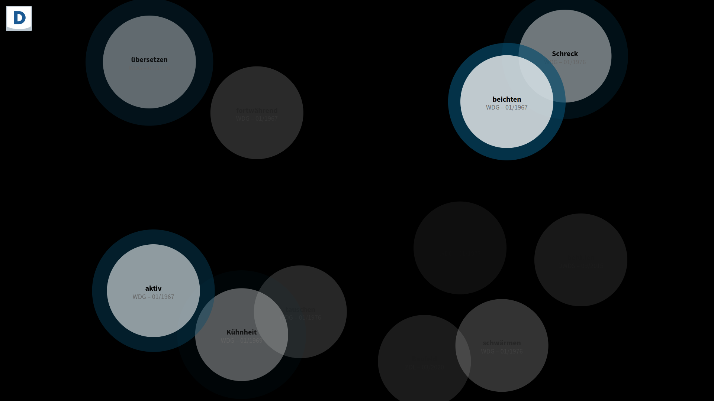

# DWDS Livestream

This project provides an **event stream of dictionary page
impressions** on [dwds.de](https://www.dwds.de/).

Currently the DWDS site serves about 90-100 HTTP requests per
second. Its access logs therefore are sizable and cannot be kept in
their entirety for the long term. While most of the log entries are of
no particular value (style and script resources, API requests etc.),
page requests for dictionary entries are worth being aggregated and
analyed over longer periods of time as they represent the central
offering to DWDS users.

## How it works

1. A server component tails the **HTTP access logs** on `www.dwds.de`,
   parsing log entries as they are written by the Apache HTTP server.
1. HTTP requests are **filtered** by URL pattern, HTTP status code and
   user agent, so that only **requests for dictionary pages from clients
   not identifying as bots** are extracted.
1. In parallel **article metadata are joined from a MySQL database**
   on `www.dwds.de`, combining the headword and timestamp of a request
   as extracted for the access logs with current editorial information
   like the source of the accessed article, the date of its last
   revision etc.
1. The stream of these dictionary page access events **can be
   subscribed to via an HTTP API**, optionally sampling the stream at
   a specified rate.

## Usage via API

The current version of the server component is based at

https://tuvok.bbaw.de/livestream/

There are 2 endpoints for accessing the event stream:

1. https://tuvok.bbaw.de/livestream/api/events , providing a
   SSE-compatible data stream, and
1. https://tuvok.bbaw.de/livestream/api/jsonl , formatting the stream as lines of JSON.

Both endpoint allow for long-polling HTTP requests and support an
optional query parameter `epm`, specifying a rate limit as „events per
minute”. For example

https://tuvok.bbaw.de/livestream/api/jsonl?epm=30

would deliver a stream sampled at a rate of 30 events per minute.

## Visualization

A sampled stream of events can be viewed on the homepage of the server:

https://tuvok.bbaw.de/livestream/



## Development Recipes

### Setup

Create `.env`
```
DEBUG=1
DWDS_LIVESTREAM_ACCESS_LOG=data/access.log
DWDS_LIVESTREAM_WBDB_USER=...
DWDS_LIVESTREAM_WBDB_PASSWORD=...
```

### Generate test access log

Stream a sample access log to the file tailed by the development
server, optionally specifying a delay between each line:

``` shell
LINE_DELAY=100 clojure -X:dev util/stream-lines! <data/dwds.de_access.log |\
    tee data/access.log
```

## Credits

The visualization was inspired by [Listen to
Wikipedia](https://github.com/hatnote/listen-to-wikipedia), a
real-time visualization and sonification of Wikipedia activity built
by Stephen LaPorte and Mahmoud Hashemi.
